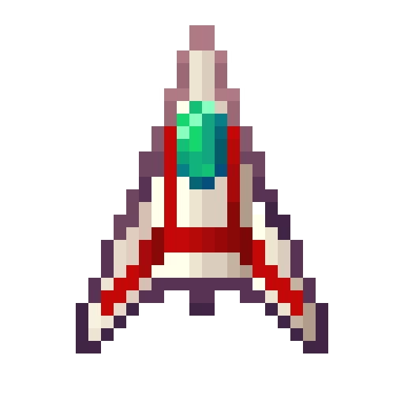
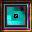
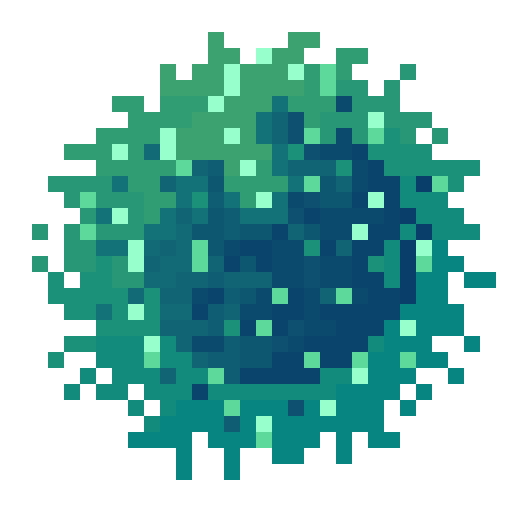

# Capsule Reaper

## Descripción
**Capsule Reaper** es un juego inspirado en el clásico "Asteroids". En este juego, en vez de destruir asteroides, tendrás que destruir virus mientras recoges power-ups que te ayudarán a sobrevivir y sumar puntos.

## Tecnologías Usadas
- **Raylib**: Librería principal utilizada para el desarrollo del juego.

## Instalación y Configuración
1. Descarga el archivo .zip del juego.
2. Extrae el contenido del .zip en tu carpeta de preferencia.
3. Ejecuta el archivo `.exe` para comenzar a jugar.

## Sprites
<!-- Aquí puedes agregar capturas de pantalla o GIFs del juego -->

## Créditos

**Desarrollador**  
Emanuel Parajon

**Texturas**  
Emanuel Parajon  
Victoria Thjellesen

**Sonido**  
ChipTone

**Música**  
Bosca Ceoil

**Menciones Especiales**  
Sergio Baretto  
Stefano Cvitanich  
Y a ti por jugar!

## Sobre Mí
Soy estudiante de primer año en Image Campus en la tecnicatura de desarrollo de videojuegos, ¡y me encantan los videojuegos!  
#imagecampus

## Enlaces
([Página de mi perfil Itch.io](https://frostpower.itch.io))
([Página del juego Itch.io](https://frostpower.itch.io/capsule-reaper))

## Licencia
Este proyecto no cuenta con una licencia específica. Todos los derechos reservados.